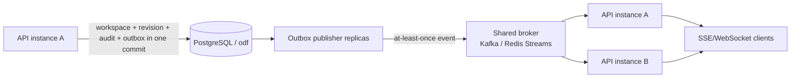

# ADR 0005: PostgreSQL production cutover and transactional outbox

- Status: Accepted
- Date: 2026-07-10

## Context

The current vertical slice uses SQLite as an embedded local-development store. It
already has a current workspace snapshot, immutable revisions, membership,
audit history and best-effort single-process SSE publication. SQLite is not the
production concurrency or multi-instance event boundary.

This ADR introduces a standalone PostgreSQL foundation only. It deliberately
does not change `apps/api`, `apps/web`, or the contracts package. A future API
adapter will use this schema after the data and cutover plan are rehearsed.

Open Data Fusion owns the `odf` schema inside its own `odf` database. A future
Keycloak deployment must use a separate database and role (preferred), or at
minimum its own schema and role; it must not use `odf` or the ODF migrator
principal.

## Decision

### Database boundary and schema

`infra/postgres/migrations/001_workspace_event_foundation.sql` creates:

- `odf.workspaces` for the current, optimistic-concurrency snapshot;
- `odf.workspace_revisions` for immutable version history;
- `odf.workspace_members` for role assignments;
- `odf.audit_log` for immutable audit evidence; and
- `odf.outbox_events` for committed integration events.

All timestamps are `timestamptz`; document-like fields are `jsonb` constrained
to objects. Foreign keys are indexed either by their composite primary key or
by an explicit inverse-lookup index. The outbox has a partial index only for
unpublished events, which keeps the publisher's hot index small.

Each migration is immutable and individually re-runnable. It executes in one
transaction, takes a transaction-scoped advisory lock, records itself in
`odf.schema_migrations`, and uses idempotent DDL. New changes require a new
numbered migration; do not edit a migration that has reached an environment.
The explicit migration service verifies `SHA256SUMS` before it runs and skips
files already recorded in `odf.schema_migrations`.

`002_workspace_owner_invariant.sql` serializes owner demotion/removal with a
transaction-scoped advisory lock derived from the workspace ID. This makes the
"at least one owner" rule safe when two API instances update different owner
rows concurrently; the application still returns the user-facing conflict,
while PostgreSQL remains the final invariant boundary.

### Authoritative workspace write transaction

The future PostgreSQL adapter must perform one short transaction, with no
network call while it holds a database lock:

1. Atomically update the current snapshot only when `version = :expected_version`.
2. If no row is returned, roll back and return HTTP 409.
3. Insert the next immutable revision.
4. Insert the audit row.
5. Insert an outbox row with a deterministic deduplication key such as
   `workspace:<workspace-id>:<new-version>`.
6. Commit.

The workspace update should take this form:

```sql
UPDATE odf.workspaces
SET snapshot = $1,
    version = version + 1,
    updated_by = $2,
    updated_at = now()
WHERE id = $3
  AND version = $4
RETURNING version, updated_at;
```

This preserves the current API's optimistic-concurrency behavior without a
long-lived `SELECT ... FOR UPDATE`. The revision, audit and outbox inserts use
the returned version within that same transaction.

### Outbox publisher and multi-instance event flow

An outbox event is not an in-memory notification. It is a durable, at-least-once
message intent written with the business transaction. A separately deployed
publisher claims work in small batches, publishes to the shared broker, then
marks a row published only after the broker acknowledges it.



Publisher replicas claim rows using a lease and `FOR UPDATE SKIP LOCKED`; they
must not hold the transaction open while calling the broker:

```sql
WITH candidate AS (
  SELECT event_id
  FROM odf.outbox_events
  WHERE published_at IS NULL
    AND available_at <= now()
    AND (lease_expires_at IS NULL OR lease_expires_at < now())
  ORDER BY available_at, occurred_at, event_id
  FOR UPDATE SKIP LOCKED
  LIMIT $1
)
UPDATE odf.outbox_events AS event
SET lease_owner = $2,
    lease_expires_at = now() + interval '30 seconds',
    attempt_count = event.attempt_count + 1
FROM candidate
WHERE event.event_id = candidate.event_id
RETURNING event.*;
```

After a successful broker acknowledgement, the publisher sets `published_at`
and clears the lease in a short transaction. On failure it clears the lease,
sets a bounded `available_at` retry delay and records a sanitized `last_error`.
Consumers deduplicate on `event_id` or the deterministic deduplication key.
Duplicate or missed client notifications are safe because clients reload and
compare the durable workspace version.

### SQLite-to-PostgreSQL cutover

The production cutover is a one-way, rehearsed migration, not an application
dual-write. Independent SQLite and PostgreSQL writes would create two sources
of truth and can produce revisions or events that cannot be ordered.

1. Rehearse an export/import against a production-like copy; validate row
   counts, workspace versions, member counts, revision hashes and audit counts.
2. Put the SQLite writer into a short maintenance/read-only window and back up
   the database file.
3. Run the PostgreSQL foundation migration.
4. Import `workspaces`, `workspace_revisions`, `workspace_members` and
   `audit_log` in dependency order. Convert ISO-8601 text timestamps to
   `timestamptz` and validate JSON before casting to `jsonb`.
5. Validate that every current workspace has its matching current revision and
   that every workspace version is contiguous.
6. Deploy the future PostgreSQL API adapter, switch reads and writes together,
   and smoke-test optimistic conflicts and event delivery.
7. Retain the SQLite backup read-only until rollback criteria expire. Rollback
   before accepting PostgreSQL writes is straightforward; after cutover, use a
   forward fix or an explicit export rather than silently replaying writes into
   SQLite.

The foundation does not insert historical outbox rows during import. The API
adapter begins emitting events only for PostgreSQL commits made after cutover;
downstream projections are backfilled explicitly from the canonical database.

## Operations

Set a non-development secret through the environment or a secret manager, then
start only the ODF PostgreSQL service and run migrations explicitly:

```powershell
$env:ODF_POSTGRES_ADMIN_PASSWORD = "use-a-secret-manager-generated-value"
$env:ODF_POSTGRES_DB = "odf"
docker compose up -d odf-postgres
docker compose --profile migrate run --rm migrate
```

Inspect the schema and migration record:

```powershell
docker compose exec odf-postgres psql -U odf_migrator -d odf -c "\\dn+ odf"
docker compose exec odf-postgres psql -U odf_migrator -d odf -c "TABLE odf.schema_migrations"
```

Back up and restore with PostgreSQL-native tools; test restores regularly:

```powershell
$backup = "odf-$(Get-Date -Format yyyyMMddHHmmss).dump"
docker compose exec -T odf-postgres pg_dump -U odf_migrator -d odf -Fc > $backup
$containerId = docker compose ps -q odf-postgres
docker cp $backup "$($containerId):/tmp/$backup"
docker compose exec odf-postgres pg_restore -U odf_migrator -d odf --clean --if-exists "/tmp/$backup"
```

The final restore command is illustrative: use an empty target database or a
controlled maintenance window, and never run `--clean` against an unknown
production target. Production deployments should use distinct migrator,
application and outbox-publisher login roles with least-privilege grants; this
foundation intentionally does not create login credentials in SQL.

## Consequences

- PostgreSQL becomes the future production source of truth for workspace state
  and event intent; SQLite remains a local-development profile until the API
  adapter is introduced.
- The broker is a delivery mechanism, not a replacement for the transaction
  log. Publisher and consumer code must tolerate duplicate delivery.
- Revision and audit rows are append-only at the database layer. Corrections
  are represented by compensating rows, not mutation of history.
- Future Keycloak work can be added without colliding with ODF tables, roles or
  migrations.
