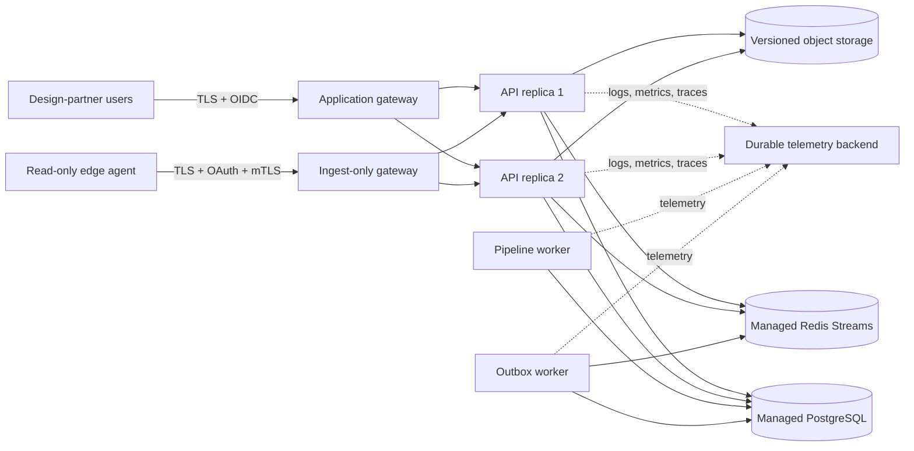

# Production Pilot Gate Design

**Date:** 2026-07-16
**Status:** Approved direction; awaiting review of this written specification

## Decision

Build a provider-neutral certification gate for one managed staging deployment
before Open Data Fusion is allowed to serve a design-partner pilot. The gate
will validate an already-provisioned environment, run or record the required
security, reliability, observability, and live-connector rehearsals, and emit a
tamper-evident evidence bundle with one deterministic go/no-go result.

The first pilot is read-only. It uses PostgreSQL as the sole authoritative
product store, shared versioned S3-compatible object storage, Redis Streams,
OIDC, two API replicas, the outbox and pipeline workers, durable external
telemetry storage, and a separate OAuth-plus-mTLS ingest listener. Industrial
write-back execution, production AI agents, production 3D, and broad platform
parity are outside this gate.

This design closes the gap between the repository's synthetic and
production-like rehearsals and a real environment-specific pilot. It does not
claim that local Compose or CI evidence is equivalent to a production pilot.

## Why this is the next milestone

The repository already has real ingestion, provenance, PostgreSQL tenant
isolation, governed objects, shared events, workers, OIDC, connector
checkpointing, observability baselines, and bounded recovery rehearsals. The
remaining risk is operational: the checked-in topology has not yet been proven
against design-partner endpoints, managed dependencies, real credential
rotation, deployment-specific network policy, sustained load, or an agreed
recovery objective.

Adding more product surfaces before closing those gates would increase the
number of unproven failure paths. The pilot gate therefore precedes the next
data-modeling, workflow, contextualization, SDK, 3D, or AI milestone.

## Goals

- Produce one repeatable, machine-readable certification result for a concrete
  deployment and immutable application revision.
- Prove tenant isolation, read-only source collection, idempotent delivery,
  durable evidence, safe failure, and recovery in the target environment.
- Certify CSV backfill, incremental PostgreSQL/JDBC collection, and OPC UA
  streaming against design-partner endpoints.
- Exercise managed PostgreSQL, Redis, object storage, OIDC, ingress, secret
  management, telemetry, and two API replicas as one system.
- Measure the initial service objectives already documented by the project and
  reject a pilot that cannot meet them.
- Retain sanitized evidence that an independent reviewer can use to reproduce
  the decision without receiving credentials or raw industrial payloads.
- Keep the gate provider-neutral so deployment adapters can target different
  clouds without changing the product's safety contract.

## Non-goals

- Provisioning a cloud account, Kubernetes cluster, managed database, managed
  Redis, object store, KMS, identity provider, or telemetry vendor.
- Multi-region availability, active-active failover, or a zero-data-loss
  disaster-recovery guarantee.
- Executing industrial write-back, controlling equipment, or validating an
  external control executor.
- General-purpose load benchmarking or a claim of Cognite Data Fusion scale.
- Adding new connector families beyond CSV, PostgreSQL/JDBC, and OPC UA.
- Shipping Data Modeling Service parity, GraphQL, Functions, AI agents, full
  P&ID vision, simulation, robotics, or production 3D.
- Automatically repairing a failed environment or weakening a gate to obtain a
  passing result.

## Pilot assumptions and safety boundary

- The pilot serves one real design-partner tenant and project. A separate
  synthetic tenant/project exists only for negative isolation tests.
- Every source credential is read-only. The edge agent initiates outbound
  connections; no deployment component receives control-system write access.
- The design partner approves the source schema, collection window, target
  volume, maintenance window, evidence retention, and incident contacts before
  a live backfill starts.
- Production authentication never enables the development user-header or query
  parameter identity paths.
- The write-back executor remains absent. Any write-back execution request must
  fail closed even if a request and approval record can be persisted.
- Synthetic test records use a reserved correlation prefix and can be removed
  only by the gate's bounded cleanup. Real pilot evidence is never deleted by
  the runner.
- The evidence bundle is retained for at least 90 days in encrypted,
  access-controlled storage. An organization may require a longer period, but
  never a shorter one for the first pilot.

## Reference topology



All application and worker database identities are least-privilege identities
separate from migration, backup, tenant-provisioning, and recovery identities.
The public application listener cannot reach dependency ports. The connector
listener exposes ingest paths only and does not expose product reads or admin
routes.

## Certification runner and evidence contract

Add a small repository-owned pilot-gate runner around the existing rehearsal
scripts and runbooks. The runner receives a non-secret deployment manifest and
secret values through the deployment's secret delivery mechanism. It must not
provision infrastructure, copy secrets into artifacts, or embed raw payloads.

Each invocation receives a unique `pilotRunId` and records:

- application commit and image digests;
- migration versions and checksums;
- deployment/environment identifier and non-secret topology facts;
- gate start/end timestamps and operator identity;
- individual check state, duration, sanitized summary, and artifact hashes;
- SLO measurement window and observed values;
- backup/object recovery point, measured RPO, and measured RTO;
- connector schema fingerprint and checkpoint transition hashes;
- reviewer identity, review time, and final go/no-go decision.

The manifest has append-only run states and only these transitions:

```text
created -> preflight_passed | failed
preflight_passed -> executing | failed
executing -> passed | failed
```

A failed run is never edited into a passing run. A retry creates a new
`pilotRunId` and references the failed predecessor. A check that cannot execute
is a failure for that run; the system must not use an "inconclusive" result to
produce a go decision.

The final bundle contains JSON summaries, sanitized command output, selected
metrics, checksums, and reviewer attestations. It excludes bearer tokens,
cookies, certificates, private keys, database URLs, object-store signed URLs,
raw source rows, and unrestricted application logs.

## Gate sequence

Gates run in the following order. A failed preflight or security gate prevents
all live-data and load activity. Later failures retain their partial evidence
but still produce a final no-go result.

### Gate 0: Deployment preflight

- Verify immutable image digests, migration checksums, database readiness,
  object-store versioning/encryption, Redis persistence policy, and clock
  synchronization.
- Verify two API replicas plus the required workers are healthy and that no
  replica can fall back to SQLite or in-memory shared events.
- Verify purpose-specific identities and reject superuser, migration-owner, or
  shared credentials in an application or worker process.
- Verify the real pilot project and the synthetic isolation project are active,
  membership-scoped, and backed by forced PostgreSQL RLS.
- Verify the deployment has enough capacity for the approved backfill and at
  least twice the measured peak steady-state source rate, or twice the
  approved CSV backfill throughput when a source has no steady-state rate.

### Gate 1: Security and isolation

- Require TLS 1.2 or newer, HSTS, managed certificate renewal, and no plaintext
  fallback on external listeners.
- Require OAuth and a trusted client certificate for the connector listener.
  A missing certificate, invalid certificate, or missing bearer token must be
  denied before ingest.
- Prove that the connector listener exposes only allowlisted ingest routes and
  strips caller-supplied identity or mTLS forwarding headers.
- Exercise default-deny network policy with positive dependency checks and
  negative direct-API, direct-database, arbitrary-egress, and cross-tenant
  checks.
- Rotate one connector credential and one TLS certificate using overlapping
  trust, verify a real transaction, and revoke the old material without
  widening policy or enabling plaintext fallback.
- Scan captured logs and evidence for the project's prohibited secret and raw
  payload patterns.

### Gate 2: Reliability and recovery

- Take a named PostgreSQL recovery point and a matching snapshot of every
  referenced object version and required KMS material.
- Restore into an isolated target, compare database table/sequence
  fingerprints, reconcile object locators and hashes, verify RLS, and read back
  a representative tenant/project, raw replay, governed-object version, Canvas
  revision, and audit correlation.
- Demonstrate an RPO no worse than 15 minutes and an RTO no worse than four
  hours. The measured values, not configured values, determine the result.
- Rehearse Redis unavailability, outbox retry, dead-letter inspection,
  independently reviewed requeue, expired-lease takeover, and per-aggregate
  ordering. Include a real network or managed-service outage in addition to
  the existing bounded local write-capacity fault.
- Rehearse rolling API replacement, one API replica loss, one worker loss, and
  dependency recovery without switching authoritative stores or synthesizing
  historical events.
- Verify retries preserve ingest idempotency and checkpoint safety with no
  missing or duplicate accepted observations.

### Gate 3: Observability and service objectives

- Export API and worker metrics, redacted logs, and traces to durable external
  storage. Local files and named volumes do not satisfy this gate.
- Deliver test alerts to the designated incident channel and record
  acknowledgement. A rule that evaluates locally but is not delivered does not
  pass.
- Measure API availability of at least 99.9% over a 30-day read-only pilot
  window and p95 request latency below one second.
- Start the 30-day measurement only after fault injection and shakedown have
  completed. Once it starts, all user-impacting unavailability counts,
  including scheduled maintenance; there are no post-hoc exclusions.
- Keep the oldest deliverable outbox event below five minutes, unresolved
  dead-letter rows at zero, Redis continuously ready, and pipeline polling
  within its configured heartbeat window.
- Add route-level views for ingest, search, telemetry, object download, and
  workspace operations so aggregate latency cannot hide a degraded surface.
- Confirm dashboards, rules, incident links, and retained evidence can be used
  by an operator who did not build the environment.

### Gate 4: Live connector certification

Certify CSV, PostgreSQL/JDBC, and OPC UA independently. Before any live write,
run the existing two-batch read-only rehearsal and obtain design-partner
approval for its mapped schema fingerprint.

For every connector:

- perform an approved historical backfill and steady-state collection;
- for PostgreSQL/JDBC and OPC UA, sustain at least twice the measured peak
  steady-state source rate for one hour without data loss, unsafe source load,
  or unbounded queue growth;
- for CSV, process the approved backfill at twice its required average
  throughput, or at the highest source-safe rate when twice the target would
  violate the design partner's source-safety limit;
- restart the edge agent and API during collection and prove checkpoint resume;
- interrupt the network, restore it, and prove bounded retry and ordered drain;
- rotate credentials without resetting checkpoints or exposing secret values;
- exercise an additive schema change and the connector's documented
  incompatible-schema failure path;
- reconcile source counts/checksums against accepted, quarantined, and rejected
  records, with every difference explained by retained evidence.

CSV replacement, truncation, or mutation before the checkpoint boundary must
fail closed. PostgreSQL/JDBC collection must remain one bounded read-only query
with deterministic ordering. OPC UA must retain per-node checkpoints and map
bad source status to non-good quality rather than silently treating it as good.

## Load and data-volume rule

The gate does not prescribe an artificial universal event rate. Before the
run, the design partner records the measured source peak, expected backfill
window, entity counts, time-series counts, average record size, and retention
needs. The certification target is:

- the complete approved backfill within the agreed maintenance window;
- for streaming and incremental sources, two times the measured peak
  steady-state rate for one continuous hour;
- for CSV, twice the required average backfill throughput or the documented
  source-safety ceiling, whichever is lower;
- no unbounded queue, memory, database, or object-store growth;
- no source-side safety or availability impact; and
- service objectives remaining within their thresholds during the test.

Changing the target after a failure requires a new reviewed manifest and a new
pilot run; it may not rewrite the failed evidence.

## Failure handling and rollback

- Fail closed on missing identity, scope, secret, certificate, migration,
  object version, telemetry sink, reviewer, or evidence artifact.
- Stop live-data activity immediately after a security or tenant-isolation
  failure. Preserve evidence, revoke temporary access, and notify the named
  incident contact.
- Stop new connector polls before draining or preserving queued bundles. Never
  delete a queue merely to make a retry pass.
- Roll back an application release to the last immutable image digest while
  keeping forward-only database migrations. Correct an applied migration with a
  new migration rather than editing history.
- Restore into an isolated target first. Application traffic moves only after
  RLS, object reconciliation, representative reads, and an explicit cutover
  decision have passed.
- Cleanup may remove only resources carrying the current reserved synthetic
  correlation prefix. Any ambiguous resource is retained for review.

## Rollout stages

1. **Synthetic managed-staging pass:** run every gate with synthetic records,
   disposable connector credentials, and no design-partner data.
2. **Approved backfill pass:** certify the three read-only connectors against
   approved source windows and reconcile their results.
3. **Seven-day shakedown:** operate continuously, resolve defects through new
   immutable releases, and restart the 30-day window after any material gate
   failure.
4. **Thirty-day read-only pilot:** collect the service-objective evidence and
   exercise scheduled rotation, recovery, and on-call procedures.
5. **Independent go/no-go review:** a reviewer who did not operate the run
   validates artifact hashes, exceptions, measured objectives, and outstanding
   risks before the final decision is recorded.

Passing the gate authorizes only the agreed read-only pilot scope. Expanding
sources, tenant scope, write-back, retention, regions, or criticality requires
a new reviewed certification manifest and, when material, a separate design.

## Testing strategy

- Unit-test manifest validation, state transitions, sanitization, artifact
  hashing, threshold evaluation, and predecessor references.
- Add static tests that require every gate, prohibited secret field, success
  threshold, and fail-closed branch in the checked-in contract.
- Reuse the existing production-like Compose, backup/restore, broker,
  observability, ingress, edge mTLS, migration, and tenant-isolation rehearsals
  as synthetic evidence producers.
- Add negative tests for expired credentials, invalid mTLS identity, cross-
  tenant access, missing object versions, stale worker heartbeat, failed alert
  delivery, incompatible connector schema, duplicate delivery, and incomplete
  cleanup.
- Keep environment-specific managed-service and live-connector tests outside
  ordinary pull-request CI. They require an explicit confirmation, named
  environment, least-privilege credentials, and retained evidence bundle.
- Run repository typecheck, tests, builds, static infrastructure validation,
  security checks, and the production-like workflow before publishing a gate
  runner release.

## Repository boundaries

- Extend `infra/ci/` with the smallest orchestration and evidence utilities
  needed to call existing drills; do not duplicate their fault logic.
- Extend `infra/ci/validate-production-gates.py` and its tests to validate the
  pilot contract statically.
- Add a non-secret example manifest under `infra/` and document the exact
  operator sequence under `docs/operations/`.
- Reuse the existing secret contract, Compose overlays, Kubernetes network
  policies, migration manifest, metrics, alerts, and runbooks.
- Add no provider SDK or product dependency. Provider-specific deployment and
  secret-manager adapters require separate approval.
- Avoid changing business API contracts unless a measured gate cannot be
  observed through existing readiness, metrics, audit, and scoped product APIs.

## Risks and trade-offs

- A provider-neutral gate cannot prove every cloud failure mode. Each managed
  deployment must still supply provider-specific outage, backup, networking,
  KMS, and alert-delivery evidence.
- Two times measured peak is a pilot safety margin, not a platform-scale
  benchmark. Capacity must be re-certified when source volume or topology
  materially changes.
- A 30-day window slows release promotion but is required to evaluate the
  stated availability objective with real operations rather than a short smoke
  test.
- Strict failure on unavailable checks may delay a pilot during third-party
  outages. Allowing an unavailable check to pass would make the certification
  result unreliable, so this design chooses delay.
- Evidence retention creates sensitive operational metadata. Sanitization,
  encryption, scoped access, and retention enforcement are part of the gate,
  not post-pilot cleanup.

## Acceptance criteria

1. A managed staging deployment can run the certification process with one
   unique pilot run ID and an immutable application revision.
2. The process produces one sanitized, hash-addressed evidence bundle and one
   deterministic `passed` or `failed` decision.
3. Missing or unexecutable required checks cannot produce a passing decision.
4. Two API replicas, PostgreSQL, Redis, object storage, workers, OIDC, ingress,
   and durable telemetry are exercised as one deployment.
5. Cross-tenant, unauthenticated, invalid-mTLS, direct-dependency, and
   prohibited-route attempts are denied and recorded without leaking secrets.
6. Database plus object recovery meets measured RPO ≤ 15 minutes and RTO ≤ 4
   hours, with RLS and representative product reads verified after restore.
7. Broker, dead-letter, lease, replica, worker, retry, and rolling-release
   scenarios recover without authoritative-store fallback, unexplained loss,
   or unexplained duplication.
8. API availability is at least 99.9% over the 30-day pilot window, p95 latency
   is below one second, outbox freshness remains below five minutes, unresolved
   dead letters remain zero, and required worker/broker health stays ready.
9. CSV, PostgreSQL/JDBC, and OPC UA each pass the applicable approved backfill
   or sustained-rate target, restart/resume, network interruption, credential
   rotation, schema evolution, and source-to-target reconciliation.
10. An independent reviewer can reproduce the go/no-go decision from retained
    evidence without access to raw source data or deployment credentials.
11. The write-back executor remains absent and execution attempts fail closed.
12. Passing the gate authorizes only the explicitly reviewed read-only pilot;
    every material scope expansion requires a new certification decision.

## Follow-on sequence

After the pilot gate passes, the recommended product sequence remains:

1. Data Modeling Service v1 with spaces, containers, views, instances, schema
   evolution, and solution-model governance.
2. A richer DataOps runtime with transformations, triggers, retries, lineage,
   and connector operations.
3. Industrial contextualization depth, then developer/analytics consumption
   surfaces.
4. Governed AI agents and production 3D only after the knowledge graph,
   permissions, and evaluation evidence are mature.

Those milestones require separate designs and do not expand this pilot gate.
